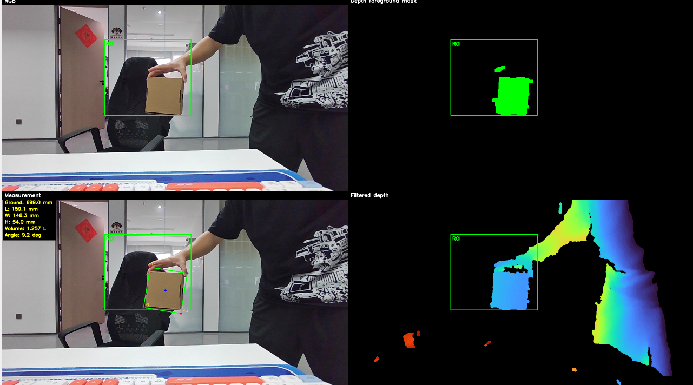
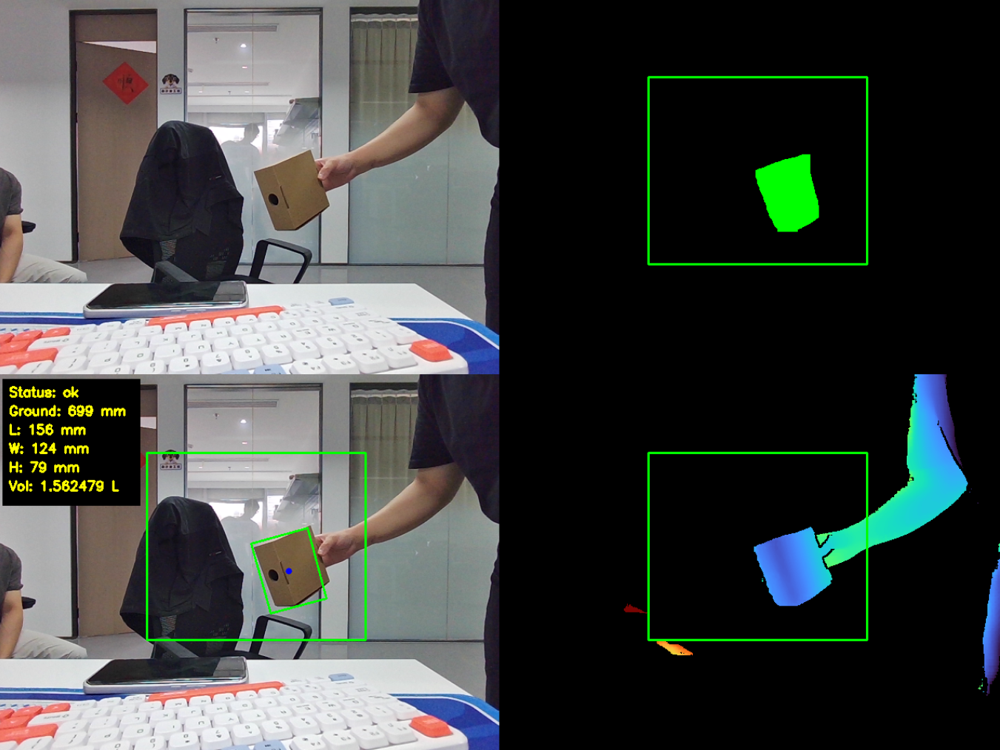

# C++ Enhanced Depth 箱体测量包

这是箱体测量项目的 C++ 增强版功能包，基于 OrbbecSDK v2 官方 `3.advanced.enhanced_depth_filter` 示例改写。它在箱体测量前先执行 `ob::Align(OB_STREAM_COLOR)` 和 `ob::EnhancedDepthFilter`，也就是接入 Orbbec 官方增强深度滤波能力（蚂蚁灵波模型），用于改善深度空洞、边缘噪声和纸盒表面深度不稳定问题。

本包适合在 Python 快速验证版已经调通 ROI、地面深度、阈值范围之后，用 C++ 原生 SDK 链路进一步提升应用效果和部署稳定性。

Python 快速验证版仓库/目录链接：[../box_measurement_pyorbbecsdk2](../box_measurement_pyorbbecsdk2)

## 包特点

- 使用 C++ 和 OrbbecSDK v2 原生 API，接近最终工程部署形态。
- 使用官方 `ob::EnhancedDepthFilter`，可加载默认模型或通过 `--model` 指定模型文件。
- 适合 Jetson Linux arm64 平台上的实时运行。
- 保留 Python 版已验证的 ROI、地面深度、深度范围、箱体高度范围和轮廓面积参数。
- 支持 OpenCV 实时四宫格调试显示：RGB、前景 mask、测量结果、增强深度图。
- 支持保存 RGB、增强深度 `.npy`、调试图和测量 JSON。

## 与 Python 快速验证版的区别

| 版本 | 主要用途 | 深度预处理 | 优点 | 适合阶段 |
| --- | --- | --- | --- | --- |
| Python 快速验证版 | 快速验证、现场调参、离线诊断 | 中值滤波 + 深度阈值分割 | 开发快、排错快、便于保存样本 | 方案验证 |
| C++ Enhanced Depth 版 | SDK 原生部署、效果增强 | `ob::EnhancedDepthFilter` 蚂蚁灵波模型 + 测量算法 | 深度更稳定、边缘更完整、适合落地 | 工程优化 |





## 运行前提

- NVIDIA Jetson / Linux arm64
- OrbbecSDK v2 已构建
- 设备支持 license authorization
- 设备具备 `EnhancedDepthFilter` 有效授权
- OpenCV C++ 开发库

官方示例说明：`EnhancedDepthFilter` 默认只支持 Jetson Linux arm64；其它平台会直接退出。

## 构建方式一：放进 OrbbecSDK_v2 一起编译

推荐在 Jetson 上执行：

```bash
cp -r ~/ws/box_measurement_cpp_enhanced_depth ~/ws/OrbbecSDK_v2/examples/
echo 'add_subdirectory(box_measurement_cpp_enhanced_depth)' >> ~/ws/OrbbecSDK_v2/examples/CMakeLists.txt
cd ~/ws/OrbbecSDK_v2
cmake -S . -B build -DBUILD_EXAMPLES=ON
cmake --build build --target box_measure_enhanced -j4
```

## 构建方式二：独立构建

```bash
cd ~/ws/box_measurement_cpp_enhanced_depth
rm -rf build
cmake -S . -B build -DOrbbecSDK_ROOT=$HOME/ws/OrbbecSDK_v2
cmake --build build -j4
```

独立构建会显式使用：

```text
OrbbecSDK_ROOT/include
OrbbecSDK_ROOT/build/src/generated
OrbbecSDK_ROOT/build/include
```

并在 `OrbbecSDK_ROOT/build` 下查找 `libOrbbecSDK.so*`。

如果构建失败，先确认 SDK 主库和生成头文件存在：

```bash
find $HOME/ws/OrbbecSDK_v2/build -name 'libOrbbecSDK.so*'
ls $HOME/ws/OrbbecSDK_v2/build/src/generated/Export.h
```

## 运行示例

使用官方增强滤波器默认模型：

```bash
./build/box_measure_enhanced \
  --roi 190,100,280,240 \
  --ground-depth 0.699 \
  --min-depth 0.55 \
  --max-depth 1.0 \
  --min-height 0.04 \
  --max-box-height 0.18
```

指定蚂蚁灵波/增强深度模型文件：

```bash
./build/box_measure_enhanced \
  --model /path/to/model.onnx \
  --roi 190,100,280,240 \
  --ground-depth 0.699
```

注意：本 C++ 版默认 color/depth 都请求 `640x480`，与官方 enhanced depth filter 示例一致。ROI 坐标也按 `640x480` 设置，不是 Python 版默认 `1280x720` 坐标。

你最近一次 Python 版稳定 ROI 是 `380,160,320,280`，对应 `1280x720` 画面。换到 C++ 默认 `640x480` 时，粗略换算为：

```text
x = 380 * 640 / 1280 = 190
y = 160 * 480 / 720  = 107
w = 320 * 640 / 1280 = 160
h = 280 * 480 / 720  = 187
```

为了避免裁到箱体边缘，建议先用更大的：

```bash
./build/box_measure_enhanced --roi 190,100,280,240 --ground-depth 0.699 --min-depth 0.55 --max-depth 1.0 --min-height 0.04 --max-box-height 0.18
```

## 快捷键

- `s`：保存当前 RGB、增强深度 `.npy`、调试图和测量 JSON
- `b`：用当前 ROI 内较远深度重新标定地面
- `d`：打印当前测量和诊断信息
- `-` / `+`：降低/提高最小箱体高度阈值
- `[` / `]`：降低/提高最小轮廓面积阈值
- `q` / `Esc`：退出

## 调参提示

1. 如果最大框贴 ROI 边界，说明 ROI 截断了箱体或包含背景大物体，先扩大或平移 ROI。
2. 如果 `foreground_px` 很大且框明显不对，优先固定 `--ground-depth`。
3. 如果画面里有手、支架或近处杂物，使用 `--min-depth` 和 `--max-box-height` 排除。
4. 如果增强深度滤波器启动失败，检查 Jetson 平台、设备授权、模型路径和 SDK extensions 是否完整。
